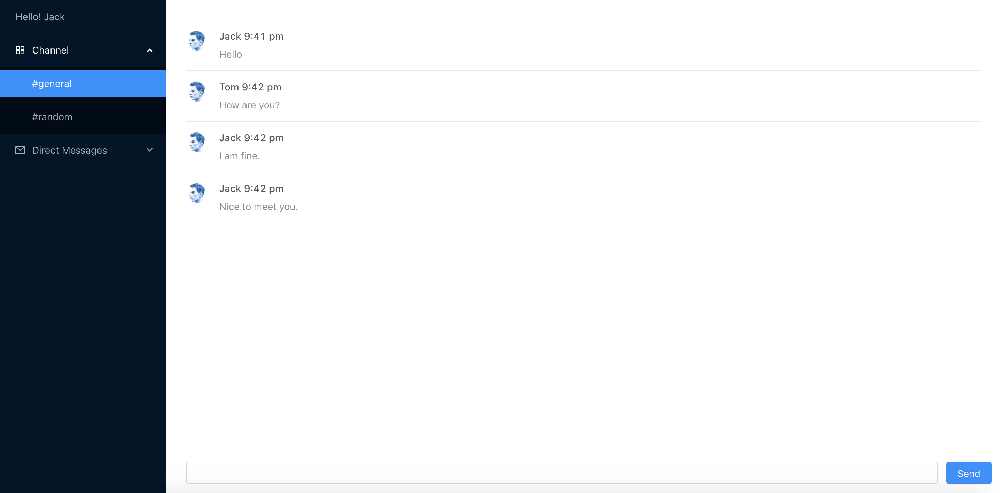

# React-Chat-App
A real time chatting application inspired by Slack
---------------------------------------------


Requirements
------------
```
bash
node
npm
```

How to start
------------
1. Clone this project: `git clone https://github.com/xiacijie/React-Chat-App.git`
2. Enter the project: `cd React-Chap-App`
3. Install node modules: `npm install`
4. Start the server: `node server/server.js`
5. Start the client: `npm start`

Screenshots
-----------




